# **1UP or 6' Under?**
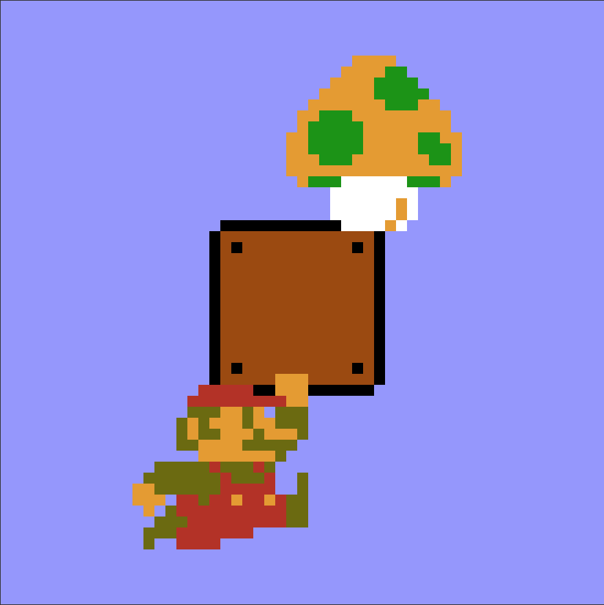
### *Classification of fungal toxicity using sklearn.*

### **The Question**

*Which of these looks tasty to you?*

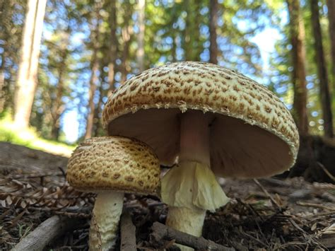

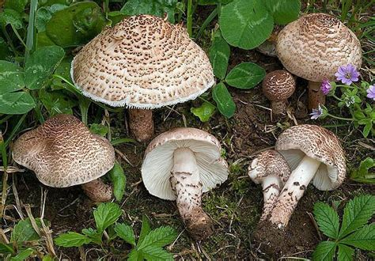

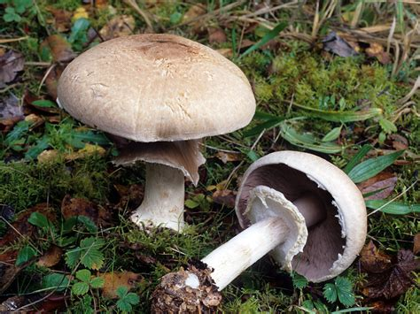

...if you chose the first mushroom, *A. augustus*, you chose an edible one! Otherwise, you're sick now (or worse!). The second mushroom, *L. brunneoincarnata* is lethally poisonous, and the third one, *A. hordensis*, will make you very sick.

*Can a computer tell you if a mushroom is poisonous or not?*

Some of the most commonly consumed or cultivated mushrooms come from the *Agaricus* genus, including the common Field mushroom as well as the White Button/Portobello. For a very long time, *Agaricus* was taxonomically linked to the *Lepiota* genus. Most of *Lepiota*'s 400+ members are poisonous, even lethally so; quite a few species within *Agaricus* are as well. So how does the average hobbit know which fungus is fun?

### **The Data**

This project made use of the excellent [Mushroom Classification Dataset](https://www.kaggle.com/uciml/mushroom-classification), which was originally put together at the UCI Machine Learning Laboratory in the late 80's. In summary, the dataset:
  - contains 8,125 observations
  - considers 23 categorical features, including one class (edible or poisonous*)
  - is very well balanced, with a 48/52 split between target classifications
  - only considers mushrooms of the *Agaricus* or *Lepiota* genera
  
### **Models & Metrics**

Given the balanced nature of the data, *accuracy* is an appropriate metric. However, considering the potentially lethal consequences of a false negative (identifying a poisonous mushroom as edible), a **low Type II error rate** is extremely important, and thus precision and recall both need to be considered as well.

After creating dummy features, exploring correlations between features, and removing features that had >90% correlation with another, the data was split on an 80/20 basis and used to train four models: Logistic Regression, k-Nearest Neighbors, Decision Tree, and Random Forest. Stunningly, the *worst* performing model (logistic regression) in training yielded a predictive accuracy of **99.82%**, and *all* models reported perfect scores in precision, recall, and F1. What?

The models were trained with 73 features, which possibly explains the high metrics. I investigated this further with a simple function to select random subsets of five features at a time to use as training and test data, which provided a very wide range of metrics (from roughly 52% accuracy up to >95%). This indicates that the models are indeed working properly and that there are really just a handful of features that are strong indicators of a mushroom's edibility (or lethality).

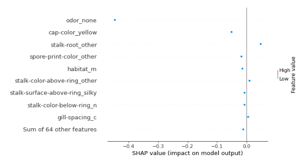
SHAP value analysis suggested five important features:
  - Odor
  - Cap Color
  - Stalk Root Type
  - Spore Print Color
  - Habitat
  
 ...and indeed, relying on just these five features in a decision tree classifer yielded excellent results!
   - 95.94% testing accuracy (10-fold CV)
   - 0.96 precision
   - 0.96 recall
   - 0.96 F1
   
 *However*, features like 'habitat' may not be readily identifiable with certainty, and spore prints are very unlikely to be done in the field, where the hobbit is encountering the mushroom and wondering if they should even pick it up. So how do we simplify this model and make it applicable to the field?

Certain histograms reveal some very interesting trends:

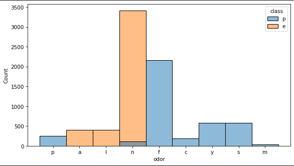

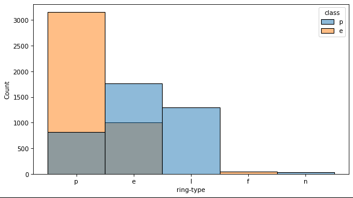

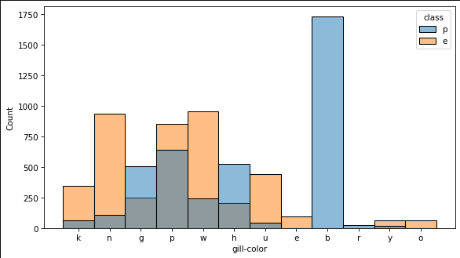

There are certain features, such as the above cases of odor, gill color, and ring type, that seem to only occur in poisonous mushrooms:
  - a foul odor
  - buff colored gills
  - a large ring on the stalk
  - a bulbous stalk root (histogram not shown)
  
...and conveniently, these features tend to agree with what successful mushroom hunting amateurs and professional mycologists suggest as far as what to look for in the field when asking whether or not a mushroom is worth even touching. Using these features in a decision tree provides a lot of confidence:
  - 92.5% accuracy in testing (10-fold CV)
  - 0.93 precision (0.87 on edible, 1.00 on poisonous)
  - 0.93 recall (1.00 on edible, 0.85 on poisonous)
  - 0.92 F1 (0.93 on edible, 0.92 on poisonous)

### Conclusion

Ultimately, though slightly less accurate, this model was selected for it's simplicity as well as it's *mobility*: four easily identifed sensory features that do not require touching the mushroom, and don't require any special materials, or a computer, and you can still be more than 90% confident about whether or not the mushroom before you is edible.

The question is, is this enough confidence, considering the possible consequences?

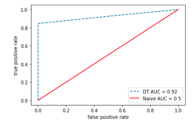

The AUC curve of this model suggests it is enough, as it does come quite close to the upper right corner. However...

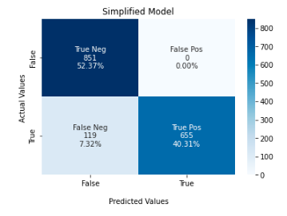

... the confusion matrix from the same model shows that the false negative rate is slightly over 7%, meaning that roughly **one in thirteen mushrooms classified as edible by this model will probably poison you**. Are you willing to take that risk? 

I'm not!

That being said, you can have a high confidence with this model that the stinky, buff-colored, ring-positive, bulbous-rooted mushroom before you is not worth touching.

I just want to say as a disclaimer that this model is **not reliable** for mushroom identification on it's own. Anyone interested in doing so should apply *all features possible* to the model, consult with a professional, and do plenty of other home testing (like spore prints, and chemical tests) before even considering consumption.

That being said, happy hunting, and thanks for reading!

## Bonus Material

#### Confusion Matrices of All Models

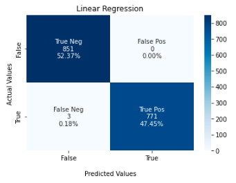

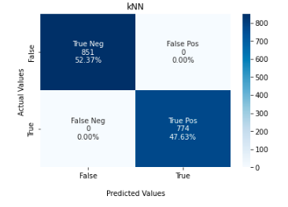

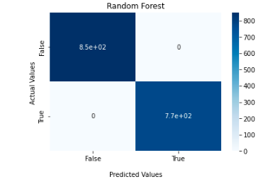

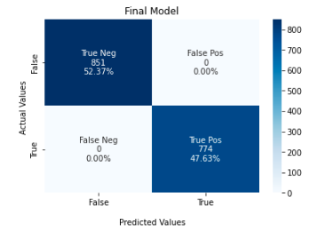
*this model is not as simple as the one presented above, as far as feature numbers and field application go.

#### Correlation Matrices

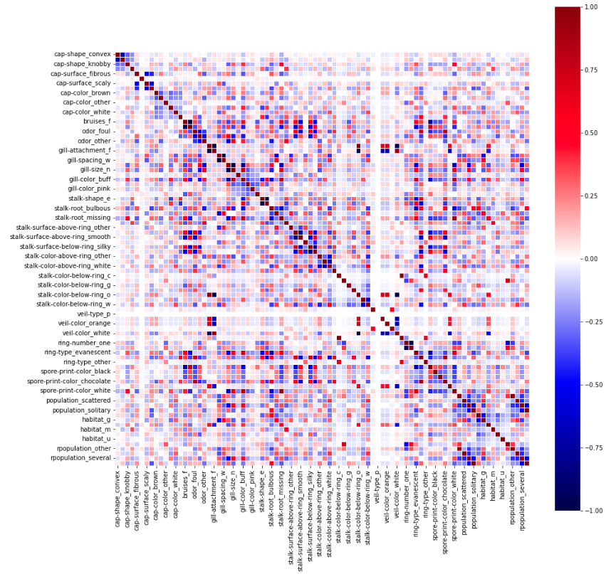
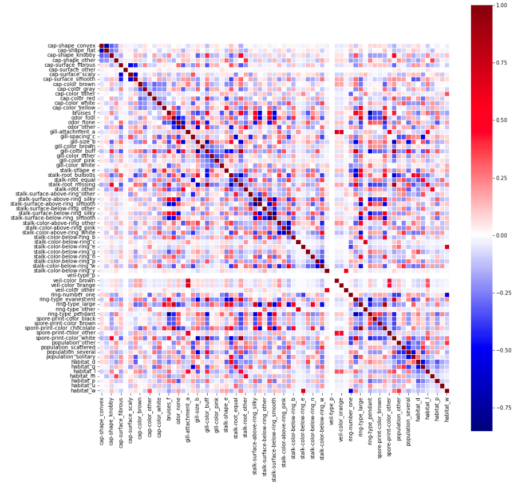
